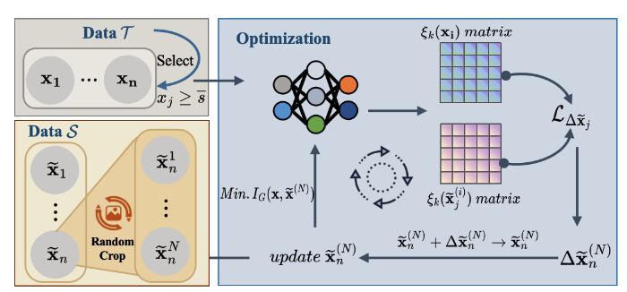
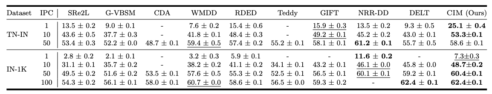
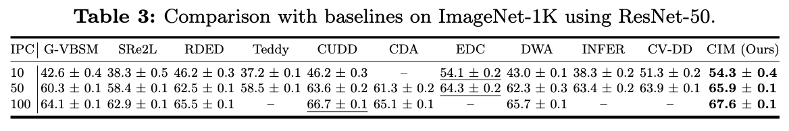
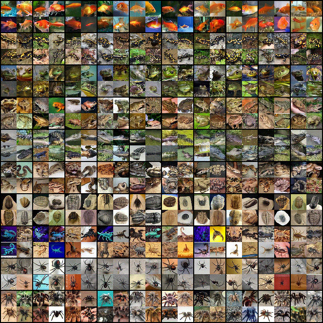
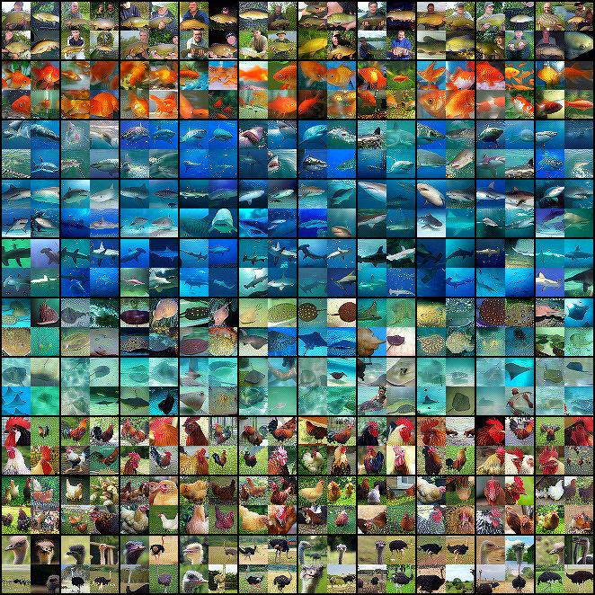

# CIM

Official PyTorch implementation of paper (ECCV 2026):

> **Condensing Large-Scale Datasets Directly with Minimal Information Loss** <br>
> [Xinyi Shang](https://shangxinyi.github.io/)\*, [Peng Sun](https://sp12138.github.io/)\*, Bei Shi\*, Zixuan Wang, [Tao Lin](https://tlin-taolin.github.io/)† <br>
> University College London, Zhejiang University, Westlake University, University of Macau

[`arXiv`]() | [`BibTeX`](#bibliography)


<p align="center">
  
</p>

> **Overview of CIM.** Per class, IPC subsets are selected from the real data $\mathcal{T}$; each initial distilled image in $\mathcal{S}$ is `RandomCrop`-augmented into $N$ views, and the effective-information gap $I_G(\mathbf{x}, \widetilde{\mathbf{x}})$ between each view and the real anchors — measured through an observer group $\{\xi_k\}$ — is iteratively minimized to update the distilled image.


## Abstract

Recent advancements in scaling dataset distillation rely heavily on decoupled information extraction pipelines, comprising SQUEEZE, RECOVER, and RELABEL stages.
Despite their scalability to large-scale datasets, these methods suffer from prohibitive computational overhead and poor cross-architecture generalization.
In this paper, we reveal the root cause of these bottlenecks: the implicit dual-compression process, from data to model and back to images, inherently induces severe information loss.
Crucially, we empirically and theoretically demonstrate that this loss creates a distribution shift that fundamentally compromises the widely adopted RELABEL strategy, transforming the pre-trained model into an unreliable labeler that yields sub-optimal labels.
To overcome these critical flaws, we propose CIM, a novel, metric-driven framework that abandons the flawed dual-compression paradigm.
Instead, CIM explicitly quantifies and minimizes the information gap between the original and synthetic datasets. By directly aligning the data distributions, our approach ensures high-fidelity information condensation and inherently satisfies the prerequisites for effective relabeling.
Extensive experiments demonstrate that CIM establishes a new state-of-the-art. Notably, **it distills ImageNet-1K at an IPC=10 in merely 80 minutes on a single RTX-4090 GPU, achieving an unprecedented 48.7% Top-1 accuracy on ResNet-18** and significantly outperforming previous SOTA approaches, such as NRR-DD and DELT, by 2.6% and 2.9%, respectively.


## Method

CIM formulates dataset distillation as **minimizing the pairwise effective-information gap** between real and synthetic samples under a group of *observers* $\mathcal{R}=\{\xi_k\}$ (a pre-trained backbone composed with random augmentations). The intractable KL gap (Eq. 5) is upper-bounded by a tractable paired feature distance (Thm. 1, Eq. 7), giving the training objective

$$\arg\min_{\widetilde{\mathbf{x}}_j}\ \mathbb{E}_{(\mathbf{x}_i,\widetilde{\mathbf{x}}_j^{(i)})}\ \mathbb{E}_{\xi_k\sim\mathcal{R}}\ \big\lVert \xi_k(\mathbf{x}_i) - \xi_k(\widetilde{\mathbf{x}}_j^{(i)}) \big\rVert^2.$$

In practice, per class we (1) select the most informative real anchors, (2) `RandomCrop`-and-mosaic them into an initial distilled set (`factor=2`), and (3) optimize a residual `delta` with AdamW so that the multi-view features of the synthetic images match those of the real anchors. Using **intermediate** features (rather than last-layer logits) balances semantic and textural fidelity.

## Installation

```bash
git clone https://github.com/LINs-lab/CIM.git
cd CIM
conda create -n cim python=3.9 -y
conda activate cim
pip install torch torchvision numpy pillow scipy
```

### How to Run

The main entry point of a single experiment is [`main.py`](main.py). To facilitate experiments running, we provide [`scripts`](scripts/) for running the bulk experiments in the paper. For example, to run `CIM` for condensing ImageNet-1K into small dataset with $\texttt{IPC} = 10$ using ResNet-18, you can run the following command:

```shell
bash ./scripts/imagenet-1k/ipc10_res.sh
```

## Data & Pretrained Models

### Storage Format for Raw Datasets

All our raw datasets, including those like ImageNet-1K and CIFAR10, store their training and validation components in the following format to facilitate uniform reading using a standard dataset class method:

```
/path/to/dataset/
├── 00000/
│   ├── image1.jpg
│   ├── image2.jpg
│   ├── image3.jpg
│   ├── image4.jpg
│   └── image5.jpg
├── 00001/
│   ├── image1.jpg
│   ├── image2.jpg
│   ├── image3.jpg
│   ├── image4.jpg
│   └── image5.jpg
├── 00002/
│   ├── image1.jpg
│   ├── image2.jpg
│   ├── image3.jpg
│   ├── image4.jpg
│   └── image5.jpg
```

This organizational structure ensures compatibility with the unified dataset class, streamlining the process of data handling and accessibility.


### Pre-trained Models
Following [SRe$^2$L](https://github.com/VILA-Lab/SRe2L), we adapt official [Torchvision code](https://github.com/pytorch/vision/tree/main/references/classification) to train the observer models from scratch.
All our pre-trained observer models listed below are available at [link](https://drive.google.com/drive/folders/1HmrheO6MgX453a5UPJdxPHK4UTv-4aVt?usp=drive_link).

| **Dataset**    | **Backbone**        | **Top1-accuracy** | **Input Size**   |
| -------------- | ------------------- | ----------------- | ---------------- |
| CIFAR10        | ResNet18 (modified) | 93.86             | 32 $\times$ 32   |
| CIFAR10        | Conv3               | 82.24             | 32 $\times$ 32   |
| CIFAR100       | ResNet18 (modified) | 72.27             | 32 $\times$ 32   |
| CIFAR100       | Conv3               | 61.27             | 32 $\times$ 32   |
| Tiny-ImageNet  | ResNet18 (modified) | 61.98             | 64 $\times$ 64   |
| Tiny-ImageNet  | Conv4               | 49.73             | 64 $\times$ 64   |
| ImageNet-Nette | ResNet18            | 90.00             | 224 $\times$ 224 |
| ImageNet-Nette | Conv5               | 89.60             | 128 $\times$ 128 |
| ImageNet-Woof  | ResNet18            | 75.00             | 224 $\times$ 224 |
| ImageNet-Woof  | Conv5               | 67.40             | 128 $\times$ 128 |
| ImageNet-10    | ResNet18            | 87.40             | 224 $\times$ 224 |
| ImageNet-10    | Conv5               | 85.4              | 128 $\times$ 128 |
| ImageNet-100   | ResNet18            | 83.40             | 224 $\times$ 224 |
| ImageNet-100   | Conv6               | 72.82             | 128 $\times$ 128 |
| ImageNet-1k    | Conv4               | 43.6              | 64 $\times$ 64   |


## Results

#### Tiny-ImageNet & ImageNet-1K, ResNet-18 (Table 2)

<p align="center">
  
</p>


#### ImageNet-1K, ResNet-50 (Table 3)

<p align="center">
  
</p>

## Visualization

Distilled images (Left: Tiny-ImageNet, Right: ImageNet-1K):

<p align="center">
  
  
</p>

## Citation

If you find this work useful, please cite:

```bibtex
@inproceedings{shang2026cim,
  title     = {Condensing Large-Scale Datasets Directly with Minimal Information Loss},
  author    = {Shang, Xinyi and Sun, Peng and Shi, Bei and Wang, Zixuan and Lin, Tao},
  booktitle = {European Conference on Computer Vision (ECCV)},
  year      = {2026}
}
```
